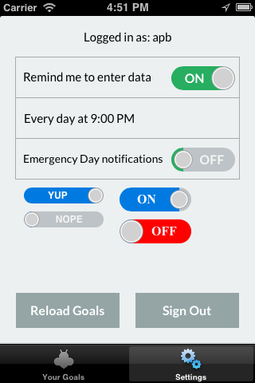

ABFlatSwitch
============

An iOS library to customize UISwitch with a flat aesthetic, which is so hot right now. 

Made by [@andrewpbrett](http://twitter.com/andrewpbrett) while working on [Beeminder](https://www.beeminder.com), a kickass tool for fighting akrasia.

Based on the excellent [DCRoundSwitch](https://github.com/domesticcatsoftware/DCRoundSwitch) library.

## About

ABFlatSwitch is a drop-in replacement for UISwitch that:

- allows customization of the colors, font, size, text, and knob inset of the switch
- does not have any shadows or gradients normally seen in a UISwitch
- otherwise behaves exactly like a UISwitch
- is ARC-compatible

## Usage

1. Add the QuartzCore framework to your project
2. Add `#import "ABFlatSwitch.h"` in your project's .pch file

You should now have the ABFlatSwitch class available. Examples: 

    mySwitch = [[ABFlatSwitch alloc] init];
    mySwitch.frame = CGRectMake(195.0f, 11.0f, 80.0f, 30.0f);
    mySwitch.labelFont = [UIFont fontWithName:@"Helvetica" size:16.0f];
    mySwitch.onTintColor = [UIColor greenColor];
    mySwitch.offTintColor = [UIColor redColor];
    mySwitch.knobInset = YES;
    mySwitch.onText = @"YUP";
    mySwitch.offText = @"NOPE";
    

## Differences from DCRoundSwitch

- Upgrade to be ARC-compatible, which fixed a crashing bug I was encountering.
- Aesthetic differences (flat vs. shadows and gradients)
- Made the color for the "off" state customizable
- Added customizable knob inset

